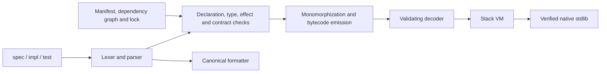

# Implementation audit — 2026-09-05

Historical first-pass findings. The [closure audit](implementation-closure-2026-09-05.md) records subsequent fixes and current validation.

## Assessment

GoPyT has a working Python-hosted compiler, canonical formatter, package checker,
bytecode emitter/loader, stack VM, and native standard library. This is substantial
implementation work. It is **not yet a complete implementation of the locked v0
contract or a production-validated language**.

The original 358 tests all passed. Independent probes nevertheless reproduced
wrong results, valid programs trapping, a model-request egress escape, writes
outside the package through symlinks, and acceptance of malformed bytecode. The
clear implementation defects identified below were repaired, with regression
tests. Remaining specification and architecture gaps are listed separately;
passing tests does not close them.

This was a broad source and behavior audit, not an exhaustive proof over every
possible program, byte sequence, operating system, or thread schedule.

## What was built



| Area | Implementation and assessment |
|---|---|
| Frontend | `lexer.py`, `parser.py`, `ast_nodes.py`, `fmt.py`. Real AST parsing and precedence-aware formatting. Closed lexical rules needed additional enforcement. |
| Static semantics | `check.py`, `types.py`, `decls.py`. Public/private boundaries, spec/impl identity, contracts, effects, imports, unions, traits, generics and HTTP checks exist. The large checker and dynamically attached methods make phase behavior harder to review. |
| Packages | `manifest.py`, package loading in `check.py`. Exact source digests and lock repairs exist. Transitive ordering, path interpretation, dependency formatting and filesystem validation needed fixes. |
| Execution | `emit.py`, `gobyte.py`, `ops.py`, `vm.py`, `values.py`. This is a bytecode interpreter, not execution of generated Python source. New `verify.py` adds abstract value/type analysis. |
| Native boundary | `natives.py`, `jsonc.py`, `server.py`. Twenty closed stdlib modules match the source catalog. Native functions perform real host operations. DB storage is deliberately process-local. |
| Hardening | `observe.py`, `evolve.py`, `prototypes/observe/`. Working streaming sketches and a mechanical limiter rewrite. Several broader hardening claims remain unimplemented. |
| Tests | Conformance, diagnostics, fixtures, formatter properties, real HTTP, VM traps, dependencies, evolution, fuzzing, repair and performance suites exist. New independent probes are in `gopyt/test_audit.py`. |

## Defects fixed

Severity reflects the behavior before this audit's repairs.

| ID | Severity | Finding and repair |
|---|---|---|
| F01 | High | **Model redirects escaped egress.** A real allowlisted local server redirected a model POST to a second, unlisted origin, which received the request. Model requests now use the redirect-denying client; response size and canonical request JSON are checked. |
| F02 | High | **`fmt` followed a source-directory symlink outside the package.** Source roots, nested entries, manifests and dependency paths are inspected before source reads/rewrites. Symlink and nonregular source entries produce E046. |
| F03 | High | **Artifact writes followed `build` symlinks.** New descriptor-relative file helpers avoid following path components; formatter/artifact writes use atomic replacement. Bytecode is validated before replacing the output artifact. |
| F04 | High | **Loader validation was height-only.** New abstract interpretation validates return values, call arguments, locals, operands and stack joins, including narrowing through enum/union/optional tests. Bad types are E100 before execution. |
| F05 | High | **Constant-index checks were bypassed by an earlier dispatch branch.** Invalid constant/local indices, including in dead instructions, are now rejected. Fallthrough, out-of-function jump targets, bad constructor shapes and unknown trap codes are rejected. Instruction lookup is no longer a linear search for every visited instruction. |
| F06 | High | **Metadata could subvert native assumptions.** Cyclic TypeExpr references, illegal map/union members, duplicate fields/variants/type names, forged opaque types, app `ffi`, invalid provide signatures and altered stdlib record layouts are rejected. Native verification now runs during decode. |
| F07 | High | **Integer widths disappeared at runtime.** `i32`, `u32` and `u64` were ordinary Python ints; `VALUE_TYPE` classified all of them as `i64`. Width-tagged values now survive conversions, containers and JSON union round trips. |
| F08 | High | **JSON silently rounded integer data.** `9007199254740993.0` decoded as `9007199254740992`. Decimal parsing now preserves exact values before range/integrality checks. Fractional and oversized values fail conversion. |
| F09 | Medium | **Different active scalar union members trapped during equality.** They now compare unequal. Enum equality also checks payload eligibility; recursive record equality checks terminate, and malformed record lengths do not compare equal by a truncated `zip`. |
| F10 | Medium | **JSON accepted/rejected the wrong boundary inputs.** Legal leading whitespace is accepted; non-JSON trailing whitespace, non-finite constants and unpaired Unicode surrogates are rejected. Deep decode failures become conversion errors. |
| F11 | Medium | **URL splitting treated a query as part of the origin.** Checker and native code now share parsed-origin extraction, reject userinfo/control characters, and accept a query on a URL with no explicit path. |
| F12 | High | **Parallel arms lost module identity.** The VM interpreted the numeric arm suffix as the module, causing valid direct outbound calls to fail egress. Nested arm/provide symbols now recover their owning module. A real socket test covers the arm case. |
| F13 | Medium | **Parallel execution allocated one thread per arm.** A bounded worker set now consumes arm indices in source order. Native entry/exit observes cancellation, and parent cancellation propagates through nested parallel work. |
| F14 | High | **HTTP concurrency was not the documented bounded queue.** `ThreadingHTTPServer` created a thread for every connection and rejected busy handlers immediately. A fixed worker pool and bounded FIFO accepted-connection queue now enforce the configured limits, return 503 on overflow and join workers on shutdown. |
| F15 | Medium | **Malformed Content-Length caused host exceptions or blocking reads.** Invalid/duplicate lengths and unsupported transfer framing fail with empty 400 responses; oversized bodies close with 413. Normal disconnect/shutdown paths no longer print host tracebacks. Signal handlers are restored. |
| F16 | Medium | **HTTP telemetry retained concrete request paths and missed input failures.** Recorded paths now use route templates, and 400/404/413/503 outcomes are observed. This does not implement the entire task-outcome model; see U02. |
| F17 | High | **Evolution used regex replacement over arbitrary source text.** A string containing `core.limit.allow(key, 8, 1000)` could change program behavior. Candidates now modify parsed literal limiter arguments and preserve strings/comments. VM proposals are restricted to the calling module. |
| F18 | High | **Evolution ignored its wall-time bound during candidate preparation.** VM-triggered preparation runs in a terminable spawned process. Timed-out work cannot apply live source changes. Candidate checks include emitted bytecode validation. |
| F19 | High | **Evolution deleted live source trees before copying replacements.** It now stages changes, installs files atomically, installs the checked lock last, detects source/dependency drift and rolls back an ordinary write failure. This is not crash-atomic replacement of the whole package; see U03. |
| F20 | Medium | **Staged evolution broke path dependencies.** Candidate snapshots now preserve the dependency graph's relative topology. Egress comparisons prevent both dropping and widening authority. |
| F21 | Medium | **Transitive lock entries were traversal-ordered and paths were parent-relative.** Entries are now root-first/name-sorted, with paths relative to the root package. Dependency sources are included in canonical-format checks, and their diagnostic/repair paths identify the dependency. |
| F22 | Medium | **Host numeric/name permissiveness leaked into the language.** Non-ASCII identifiers/numbers, oversized integer tokens, oversized version/port values and invalid secret names are rejected without accidental host conversion errors. Duplicate enum payload fields are also rejected. |
| F23 | Medium | **Polymorphic recursion could expand specializations without a guard.** Direct recursion is checked even in unused generic declarations; instantiated mutual recursion tracks ancestry and reports E029 on changed type arguments. |
| F24 | Medium | **Some collection allocations omitted trap-14 checks.** String/byte concatenation, map growth and file reads now check the per-allocation bound. Descriptor-relative runtime file access also refuses FIFOs/nonregular entries without blocking. |
| F25 | Medium | **Tests propagated stdlib `ffi` contrary to S9.** Inferred test effects now retain database effects while leaving stdlib-only `ffi` on the native. The outdated C031 expectation was corrected under S27 precedence. |
| F26 | Medium | **Count-Min sizing did not meet the documented parameter bounds.** Default buffers now use width 272 and depth 5 for epsilon/delta 0.01. Runtime and prototype use the same dimensions. Observe reports take a consistent locked snapshot. |
| F27 | Medium | **The standalone P0 experiment did not match the declared experiment.** It previously used a 0-to-40% shift. Tests/calibration now run a 1%-to-15% shift and a same-length 1% control, with reported numbers. |
| F28 | High | **Digest preimages were ambiguous for paths containing newlines.** A two-file tree and a different tree with one crafted filename produced exactly the same serialized hash input. CR/LF in source-tree path components are now E046 under an explicit `lockfile.md` security amendment. This fixes serialization ambiguity; it is not a collision in SHA-256 itself. Ordinary package digests remain unchanged. |

## Evidence and reproducibility

- Initial suite: **358 tests, exit 0**. This demonstrates why the old green suite
  was insufficient, not that its tests were useless.
- First independent probe batch: **14 tests, 17 failed assertions/subtests and
  one error**. The model redirect probe separately observed `/private` reaching
  an unlisted server before the fix.
- Final suite: **401 tests, exit 0** — 43 additional audit test methods.
- Audit properties include **2,000 seeded bytecode mutations** and **250 generated
  arithmetic expressions** compared with an independent integer evaluator.
- All **54 on-disk conformance fixtures** remain covered by the full suite.
- P0: **6 tests, exit 0**. The explicit calibration used 20 trials of 3,400
  events: **0/20 control alarms**, **20/20 shifted-stream alarms**, detection
  **38–120 events after the shift**, and **1,400 fixed buffer/counter cells**.
  These are small-sample calibration results, not production detection guarantees.
- Stdlib synchronization: **20 modules, exit 0**. Python compilation: **exit 0**.
- HTTP probes used real local sockets. Fault injection in host unit tests covers
  write failure and small queue/allocation boundaries; it does not substitute
  mocked application effects for the language's runtime tests.

Run from the repository root:

```sh
python3 -m unittest discover -s gopyt -t . -p 'test_*.py'
python3 -m unittest gopyt.test_audit
python3 prototypes/observe/test_sketches.py
python3 prototypes/observe/calibrate.py
python3 tools/check_stdlib_sync.py
python3 -m compileall -q gopyt tools prototypes
```

Saved outputs and fingerprints are in
[the evidence directory](audit-evidence/2026-09-05/summary.json).
The final test run is [recorded here](audit-evidence/2026-09-05/tests.txt).

## Remaining release gaps and decisions

These remain open. They must not disappear behind a “v0 validated” label.

| ID | Finding | Required follow-up |
|---|---|---|
| U01 | **Tracing GC is not implemented as specified.** `charter.md` D12 explicitly rejects relying on the host memory model. Values are Python objects; there is no VM-owned tracing/mark-sweep heap with explicit stack/local/scheduler roots. | Implement and test that heap, or explicitly amend D12 and `bytecode.md` to accept the host memory model. Do not call the current Python allocation model the specified collector. |
| U02 | **The complete bounded telemetry/hardening model is absent.** No Bloom filter, capped `build/traces` dump, or complete automatic task/union outcome tracing exists. `vm.buckets` retains each distinct rate-limit key. A real VM probe retained **10,000 buckets for 10,000 keys**, while the observe cell count stayed 1,400. | Define a safe bucket-capacity/admission/expiry policy; eviction must not silently reset an attacker's limit. Define failure classification for arbitrary user union variants and the missing trace/Bloom formats before implementing them. Existing fixed-sketch tests prove only the sketches' bound. |
| U03 | **Evolution is not a package-wide atomic transaction.** File replacements and the lock commit are individually atomic; interrupted apply can leave a stale lock. There is no crash-recovery journal or serialization against unrelated concurrent source writers/processes. Preparation is interruptible; filesystem commit itself is not a hard real-time operation. Candidate selection has no learned fitness/weight history or implemented reservoir replay. Agent evolve settings are passed from the compiler, not serialized in bytecode. Multiple evolve agents in one module have no specified selection rule. | Specify the transaction/recovery and ownership model, artifact metadata and candidate fitness precisely. Crash/concurrency testing must accompany implementation. The current fail-closed lock behavior and rollback are improvements, not the whole promise in `evolve.md`. |
| U04 | **Loop-local storage conflicts with the bytecode contract.** `bytecode.md` says `STORE_LOCAL` to an initialized slot always traps, while the emitter reuses loop-counter/body slots and the VM exempts slots found inside back edges. | Amend the loop storage rule and validate the corresponding loop structure, or change lowering/opcodes and the VM together. This audit did not silently choose a new instruction-set contract. |
| U05 | **Parts of the authoring/elaboration contract remain inconsistent or incomplete.** The parser accepts soft keywords needed by the stdlib although the grammar describes reserved names; `reservoir` is missing from the keyword list in parts of the docs. `elaborator.md` describes import/literal/match reordering that conflicts with higher-priority formatter rules. Test-stub/uniquely-determined-body elaboration is not a complete implementation of the described E-D pipeline. Global diagnostic phase/position ordering is not established by the first-error architecture. | Reconcile the exact grammar, formatter and elaborator contract under S27, then add direct conformance fixtures. Avoid making the formatter reorder effectful computations. |
| U06 | **Empirical/release validation remains incomplete.** P2's repair helper is mechanical; no live agent repair evaluation was performed. No Windows/macOS, external TLS/provider, long-duration service, kill-during-commit or hostile concurrent-filesystem certification was performed. The new descriptor helpers use POSIX facilities. This checkout has no `.git` directory or CI configuration. | Run live-agent P2, platform and sustained integration tests; establish packaging/CI and a versioned toolchain release. The unreleased toolchain id remains `gopyt-0.1.0`; use the saved compiler fingerprint to identify this audit's exact implementation. |

The unresolved entries are architecture/specification or unperformed empirical
work. They are not claimed to have been fixed by adding passing tests.

## Handoff

- Toolchain: `gopyt-0.1.0`; host: Python 3.14.6 on Linux.
- Repository package digest: **none** — the compiler repository itself has no
  `gopyt.toml`. `examples/auth` digest:
  `sha256:8a3466ed3972227f7b307bbc795f502e0911a018437ad394e13cad07acca03af`.
- Application `spec/` files changed: **none**.
- Application `impl/` files changed: **none**. Tests/probes stage temporary packages.
- Public application contract ids changed: **none**. C031 documentation was
  aligned with the existing S9 rule. `lockfile.md` received an explicit CR/LF
  path restriction to prevent ambiguous digest preimages. No new language
  syntax, effects or opcodes were introduced.
- Implementation/test/document files changed: listed in the evidence manifest.
- Final failed tests: **none**. Skipped tests in the final suite: **none**.
- Runnable auth example `open`/`unresolved` ids: **none**.
- Audit open ids: **U01, U02, U03, U04, U05, U06**.
- Commit/PR: **none**; this workspace is not a Git checkout.
