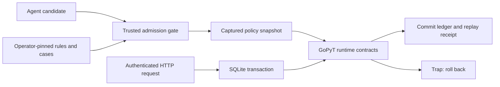

# Preserve refund rules while an agent edits code

This is a runnable local refund-ledger component. GoPyT enforces the refund
predicate and cumulative amount; a trusted Python adapter handles authenticated
HTTP, versioning, idempotency and SQLite transactions. No payment processor is
called. This is not an accounting reconciliation or a production payment system.

The practical problem is an agent “fixing” a failing change by weakening its
specification, tests or checker. This example lets the agent change the policy's
implementation while an operator-controlled bundle pins everything else.
Changing both spec and implementation now fails admission.

## Trust boundary

The **candidate directory is untrusted**. The executor installation, bundle hash,
bundle, adapter, credential map, seed import and database belong to the operator.
Keep them outside the agent's write authority (separate CI job/service account,
protected configuration and required checks). Do not run a candidate-provided
workflow and accept its own claim that it passed. An agent with operator/host
privileges can replace this boundary; a checksum does not prevent that.

The gate captures bounded regular files without following symlinks, checks the
complete file inventory, pins protected files and the Python/GoPyT engine,
regenerates the derived lock in a disposable copy, then compiles and executes
independent acceptance vectors using isolated Python import paths. Candidates
cannot supply dependencies, Python hooks, additional tests or an alternate gate.
Only pure GoPyT functions are supported. This is not an OS sandbox against an
exploitable compiler/interpreter. Linux gate workers have a 512 MiB address-space
limit; gate deadlines and cooperative VM deadlines fail closed.

The adapter executes its admitted snapshot. Editing the candidate afterwards
does not change a running service. Editing the adapter invalidates its bundle.
Receipt hashes bind the input snapshot, bundle and engine. Listed obligations are
not automatically proved: the gate covers policy vectors; HTTP/transaction
obligations are exercised by the separate integration suite and replay.



## Rules for this component

- Amounts are integer GBP pence, positive and at most the remaining balance.
  Paid balances are 0 through 1,000,000,000,000 pence.
- A new refund requires an open order and its current version. Versions start
  at one; no new operation is accepted at version 1,000,000,000.
- Refunded value increases exactly by the accepted amount. Identity is preserved.
- A customer-bound bearer credential is required. Customer ID alone is not proof
  of identity. Tokens belong in a trusted secret file; use randomly generated
  values of at least 32 characters.
- The same idempotency key and payload returns the stored response, including
  after restart. A changed payload with the same key is a conflict.
- An identical retry still returns its historical success if the order later
  closes. It is not a new refund. Failed requests do not reserve a key.
- Ledger update and idempotency record share one SQLite transaction. A FIFO
  queue prevents in-process writers from starving each other; SQLite arbitrates
  other processes. FULL synchronization remains enabled.

The `/refunds` endpoint only changes the local ledger. Trusted import establishes
paid balances and identity. Closed state is managed by the owning application;
there is no public endpoint for setting balances or reopening an order.

## Run from the repository root

Prepare a review bundle in an **operator-owned location**. This command prepares
bytes; it does not establish external business approval.

```sh
python3 -m examples.guarded_refunds.freeze --out /tmp/refund-bundle.json
```

Review the rules, adapter, vectors and hashes in that file. Take the printed
SHA-256 and pin it in operator-owned configuration. Do not compute approval from
whatever bundle the candidate submits. Use a fresh receipt filename:

```sh
python3 -m gopyt.guard \
  --bundle /tmp/refund-bundle.json --expected-sha256 YOUR_REVIEWED_HASH \
  --candidate examples/guarded_refunds/policy --receipt /tmp/refund-receipt.json
```

Create a trusted seed array such as
`[{"id":"order1","customer":"customer1","paid":10000}]`, and a trusted JSON
credential object mapping a random bearer token to `customer1`. Then:

```sh
python3 -m examples.guarded_refunds.service \
  --candidate examples/guarded_refunds/policy \
  --bundle /tmp/refund-bundle.json --expected-sha256 YOUR_REVIEWED_HASH \
  --db /tmp/refunds.sqlite --seed /path/to/orders.json \
  --credentials /path/to/credentials.json --port 8085
```

Omit `--seed` on restart; duplicate imports are refused atomically. The service
binds only `127.0.0.1`. POST JSON to `/refunds` with `Authorization: Bearer TOKEN`:

```json
{"order_id":"order1","customer_id":"customer1","amount":3000,
 "expected_version":1,"idempotency_key":"refund-1"}
```

Expected statuses: 200 accepted/replayed, 400 malformed request, 401 invalid
credential, 403 wrong authenticated customer, 404 unavailable order/route,
409 business conflict, 413 oversized body, 415 unsupported media type, and
503 execution/storage failure. Reuse the same key when retrying an ambiguous
network result. This service has no Internet-facing TLS, rate limiter, credential
rotation endpoint or operational monitoring; those are deployment integrations.

## Reproduce the evidence

```sh
python3 -m unittest gopyt.test_guard -v
python3 benchmarks/guarded_refunds/prepare_data.py
python3 -m benchmarks.guarded_refunds.run --out /tmp/refund-e2e-new-run
```

The normalizer expects the retained raw ZIP at
`benchmarks/guarded_refunds/data/online-retail.zip`. Provenance records source,
license, raw/normalized hashes, exact exclusions and normalization. Replays use
every eligible invoice, actual loopback HTTP, the GoPyT VM and SQLite; they check
every resulting ledger row, replay across restart, and retain the resulting DB.
Refund scenarios and settled balances are **simulated from real invoice inputs**.
They are not claimed to be observed real-world refund outcomes.

See [the R&D record](../../docs/agent-evidence/2026-09-08-guarded-refunds/REPORT.md)
for failed rounds, corrections and final measured results. This demonstrates a
bounded solution, not universal correctness or an advantage over properly
protected Go, Python or TypeScript implementations.
